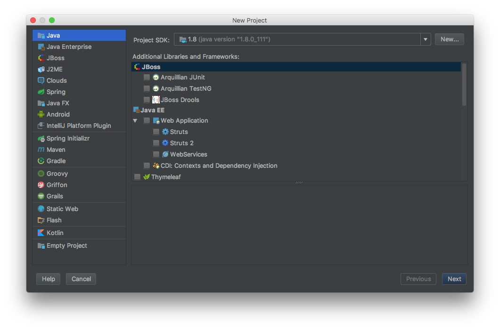
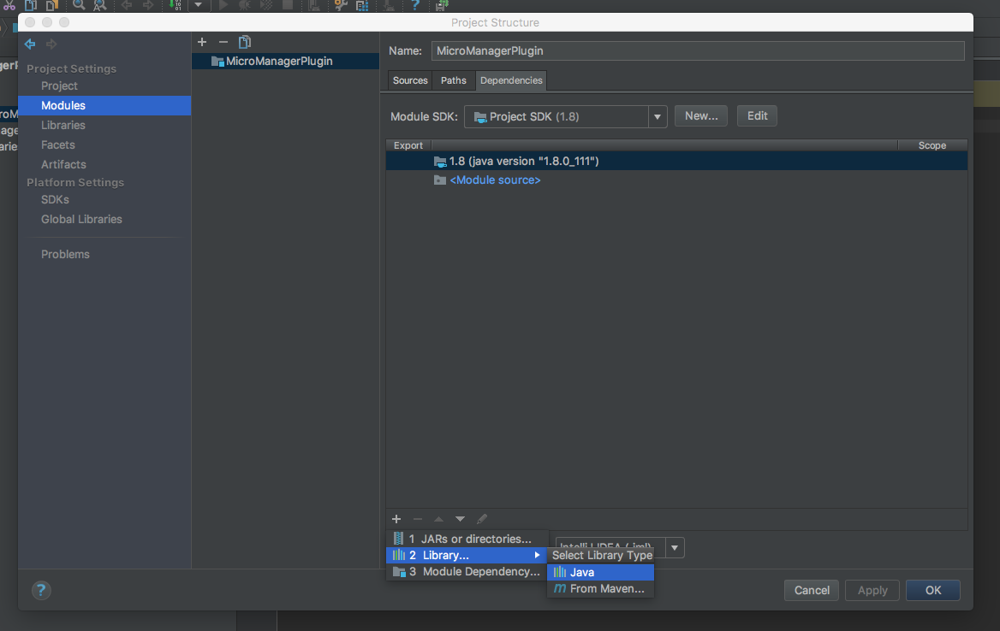
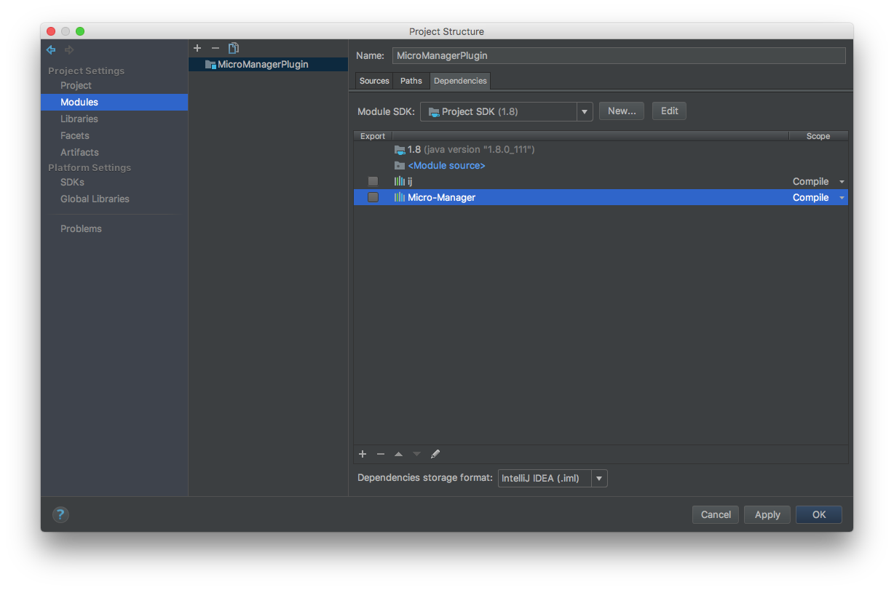
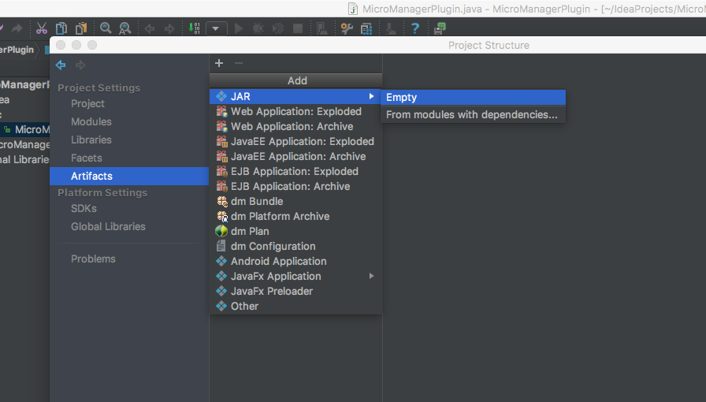
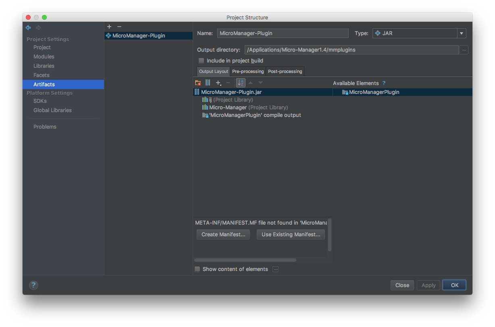
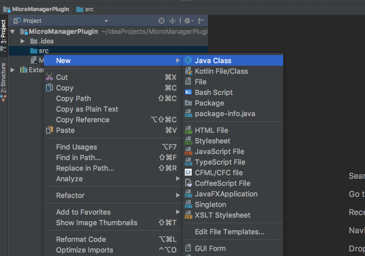
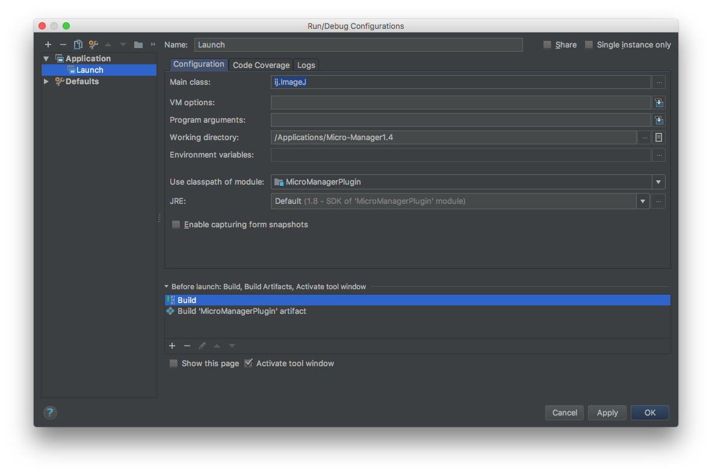
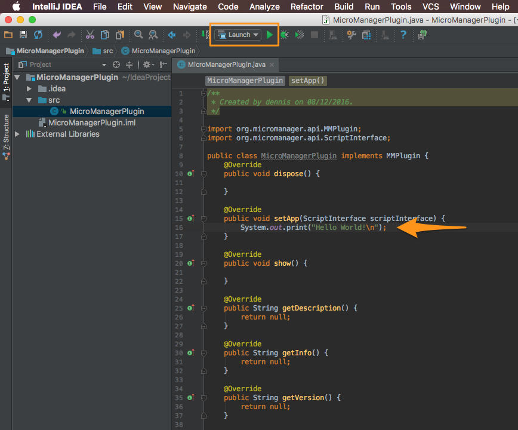
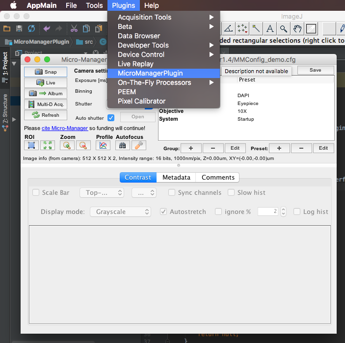
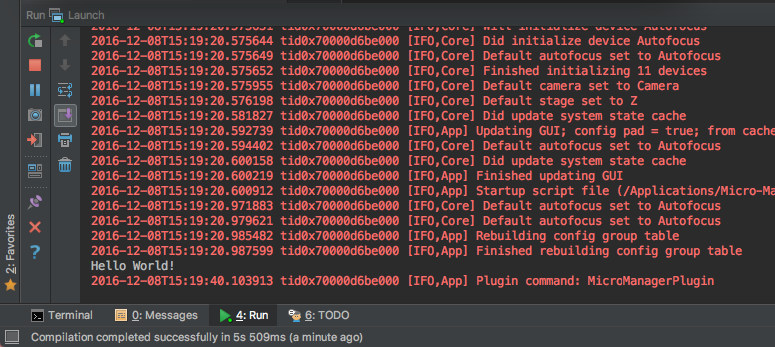

We in our lab are using [Micro-Manager](https://www.micro-manager.org) to control a very sensitive camera of a photoemission electron microscope (PEEM). This has the advantage of using free, open source software with high compatibility and extensibility. The tight binding to [ImageJ](https://imagej.net), an image processing application, makes it a comprehensive imaging solution for scientific purposes.

Recently I wanted to extend the functionality of Micro-Manager and put some effort into researching how to do this. I found [these](https://micro-manager.org/wiki/Writing_plugins_for_Micro-Manager) instructions to set up the development environment for [Netbeans](https://netbeans.org/) and [Eclipse](https://eclipse.org/), which are both great choices if you want to do Java development. But due to my software development background I got quite familiar with [Jetbrains](https://www.jetbrains.com/) IDE's like [PyCharm](https://www.jetbrains.com/pycharm/), [RubyMine](https://www.jetbrains.com/ruby/) or [WebStorm](https://www.jetbrains.com/webstorm/). This motivated me to set up the development environment for Jetbrains [IntelliJ](https://www.jetbrains.com/idea/) and because there are quite a few things to configure I thought of writing a quick run through.

## Prerequisites

* [Jetbrains IntelliJ](https://www.jetbrains.com/idea/)
* [Micro-Manager 1.4](https://www.micro-manager.org)
* [ImageJ](https://imagej.net) (Micro-Manager contains a copy of the entire ImageJ application, so no action required)

Now we're all set - let's start setting up our project.

> This tutorial assumes that Micro-Manager is installed under `/Applications/Micro-Manager1.4`.

## Setting up IntelliJ IDEA

### Project creation
Creating a new project by going to `File -> New -> Project` or by clicking on `Create New Project` on the welcome screen of IntelliJ. Leave everything as it is on the next screen and make sure you are using a java version >= 1.6 (Project SDK).

Leave `Create project form template` unchecked and click next. On the next screen provide a project name (for demonstration purposes I chose `MicroManagerPlugin`) and ideally put it in a folder (Project location) with the same name. Choose finish to get to the actual IDE window.

### Adding dependencies

Go to `File -> Project Structure` or use the shortcut `CMD` + `;` and choose `Modules`. You should see this window:

Now we need to add `ij.jar` and the `plugins/Micro-Manager` subdirectory from the Micro-Manager installation to our project. So click on the `+` button on the bottom panel and choose `Library... -> Java`.

Navigate to the Micro-Manager installation directory (`/Applications/Micro-Manager1.4` and select `ij.jar`). Confirm the `Configure Library` pop up window. Repeat this step by adding the `Micro-Manager` directory under `/Applications/Micro-Manager1.4/plugins/Micro-Manager`. You should end up with the following set up:


Head over to `Artifacts` and click on the `+` sign. Choose `JAR -> Empty`.


We end up with an unnamed artifact. Give it an expressive name, because what you enter here will actually show up in the menu panel of Micro-Manager. I chose the same name as the project name, `MicroManagerPlugin`.

The output directory should point to the `mmplugins` directory of the Micro-Manager installation `/Applications/Micro-Manager1.4/mmplugins`. All `.class` and `.jar` files in Micro-Manager's `mmplugins` directory will be loaded at startup. So letting the output directory point to that folder ensures, that on every build our plugin is in the right directory.

Under `Available Elements` we can see the two libraries we just added and a row `'MicroManagerPlugin' compile output`. Double click on each item to move it over to your artifact jar, so that it looks like this:

Confirm your changes and close the `Project structure` window by clicking `OK`. Now it's time add some code.

### Adding the base class
Right-click on the `src` folder in the Project Structure panel and choose `New -> Java Class` (if you can't see this panel press `CMD` + `1`). In the pop up window give your class a meaningful name and click `OK`, I chose `MicroManagerPlugin`.

You should find a new file in the `src` folder with the following content:

```java
/**
 * Created by trtwn on 22/12/2016.
 */
public class MicroManagerPlugin {
}
```

Replace these five lines with the following code:

```java
/**
 * Created by trtwn on 22/12/2016.
 */

import org.micromanager.api.MMPlugin;
import org.micromanager.api.ScriptInterface;

public class MicroManagerPlugin implements MMPlugin {
    @Override
    public void dispose() {

    }

    @Override
    public void setApp(ScriptInterface scriptInterface) {

    }

    @Override
    public void show() {

    }

    @Override
    public String getDescription() {
        return null;
    }

    @Override
    public String getInfo() {
        return null;
    }

    @Override
    public String getVersion() {
        return null;
    }

    @Override
    public String getCopyright() {
        return null;
    }
}
```

> Keep in mind: In Java filename and class name have to be the same. So if you named your class _file_ differently you need to change the class _name_ to equal the filename after pasting that code.

We let our `MicroManagerPlugin` class inherit from a provided `MMPlugin` abstract class. This required us to override seven methods. Those are necessary for Micro Manager to successfully communicate with our plugin. Here's what each function does:

Method | Description |  
--|---|
`dispose` | The main app calls this method to remove the module window. Perform any necessary clean up here. |
`setApp` | This method get's called first when you click on the plugin name in the menu panel. `scriptInterface` is an objects which exposes an API to execute commands in the main panel. Have a look at the [docs](https://valelab4.ucsf.edu/~MM/doc/mmstudio/org/micromanager/api/ScriptInterface.html). `scriptInterface.getMMCore()` gives you access to the core and its functionality. |  
`show` |  This method get's called second after choosing our plugin within Micro Manager. Use this method to set up your GUI. |  
`getDescription` | A tooltip when hovering over the plugin name |  

The remaining three are pretty self explanatory. If not, have a look [here](http://javadoc.imagej.net/Micro-Manager-Studio/org/micromanager/api/MMBasePlugin.html).

### Defining build configurations

Go to `Run -> Edit Configurations...`. Click on the `+` in the top left corner and choose `Application`. Give that configuration a name (I chose `Launch`). Under `Main Class` insert `ij.ImageJ`, `Working directory` needs to point to Micro-Manager's installation directory (`/Applications/Micro-Manager1.4`). Under `Before Launch:` click on the `+` sign and choose `Build Artifacts`. In the upcoming popup select our previously configured artifact. Your configuration should look similar to this:


## Testing our configutarions
In the `setApp` function add `System.out.print("Hello world!\n");` to confirm that our configuration was successful.



Click on the green arrow in the top panel or alternatively type `CTRL` + `R` to start the build process. If nothing happens make sure that you're actually running our previously defined run configuration (`Launch`). If everything works fine Micro-Manager should start up and log messages should appear. Navigating to `Plugins` in the menu bar reveals our plugin.

After clicking on our plugin's menu item the `setApp` function gets called and `Hello world!` gets printed to the IntelliJ log window.


## Conclusion

We've successfully set up an environment to develop Micro-Manager Plugins with IntelliJ! This walk through wouldn't have been possible without [Writing plugins for Micro-Manager](https://micro-manager.org/wiki/Writing_plugins_for_Micro-Manager).
